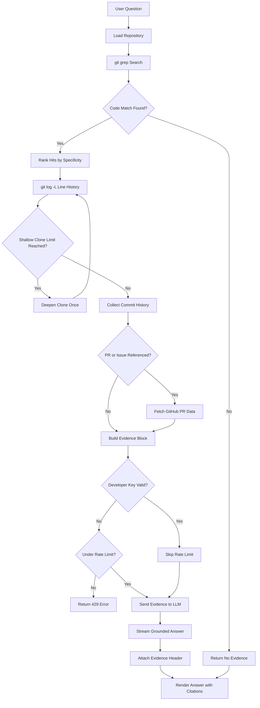

# Onboarding Buddy — Codebase Archaeology
Most "chat with your codebase" tools just feed code into an LLM and hope for the best. Onboarding Buddy instead grounds every answer in verifiable evidence: it traces a question through git grep → git blame → the actual commit message → any linked GitHub PR, then hands the LLM only that retrieved evidence with explicit instructions to cite a commit hash or PR number for every claim — and to say "I don't know" rather than guess when the evidence is thin. Built with FastAPI and Llama 3.1, deployed on Render.
Point it at any git repo and ask "why does this work this way?" — instead of
guessing, it traces the answer through real evidence:

```
your question
   → git grep (find relevant code)
   → git blame (find the commit that last touched it)
   → git show (read the full commit message)
   → GitHub API (fetch the linked PR/issue, if the commit message references one)
   → LLM (answer, citing the commit hash / PR number as evidence)
```

If there's no good evidence, the model is instructed to say so rather than
invent history.

## Setup

```bash
cd backend
pip install -r requirements.txt

export GROQ_API_KEY=your_key_here       # https://console.groq.com or any api key at your convenience
export GITHUB_TOKEN=your_token_here     # optional — raises GitHub's 60/hr
                                        # unauthenticated rate limit to 5000/hr

export DEV_API_KEY=some_long_random_secret   # optional — see "Access modes" below
export RATE_LIMIT_LOAD_PER_MIN=3             # optional, default shown
export RATE_LIMIT_ASK_PER_MIN=8              # optional, default shown

uvicorn main:app --reload --port 8000
```

Then open **http://localhost:8000** — the FastAPI app serves the frontend
directly, no separate server needed.

## Access modes

By default every request is rate-limited per IP (`RATE_LIMIT_LOAD_PER_MIN`
and `RATE_LIMIT_ASK_PER_MIN`), since a deployed instance is a shared, public
resource burning your Groq/GitHub API quota. This is "user mode" — no setup
needed, it's the default.

To bypass limits for yourself, set `DEV_API_KEY` to a long random secret and
paste that same value into the "Developer key" field in the sidebar (it's
sent as an `X-Dev-Key` header and persisted in your browser's localStorage,
never anywhere else). Requests with a matching key skip rate limiting
entirely — that's "developer mode."

If `DEV_API_KEY` is never set, developer mode is effectively disabled and
every request is rate-limited, including ones that send a key — there's no
way to accidentally leave this open.

## Using it

1. Paste a local path to an already-cloned repo (fastest), or a GitHub URL
   (it'll be shallow-cloned into `/tmp/onboarding-buddy-repos`), and click
   **Load repository**.
2. Ask a question like:
   - "Why does the retry logic wait 3 seconds instead of using exponential backoff?"
   - "Why was this validation moved out of the constructor?"
3. Optionally point it at an exact `file_path` + `line` in the sidebar if you
   already know where the code lives — this skips the keyword search and
   blames that exact line directly.

## Retrieval eval

`eval/run_eval.py` measures whether the retrieval pipeline actually finds
the right evidence — hand-verified against `pallets/flask` by running
`git log -L` directly and confirming the expected commit by hand. This
tests retrieval only (search + blame history), never the LLM, so it's a
repeatable, free, fast signal independent of model output variance.

```bash
cd backend
GROQ_API_KEY=unused python eval/run_eval.py
```

Current result: **10/10 (100%)** — 6 cases checking whether `line_history()`
finds the real originating commit for a line (not just its last cosmetic
edit), 4 cases checking whether `search_code()` ranks real function
definitions above docs/changelogs for a natural-language question.

This number is earned, not assumed: building this eval caught a real
scoring bug (a generic word like "default" matching an unrelated function
name was outranking the actual `SESSION_COOKIE_SECURE` identifier) that
dropped search accuracy to 75% until `_score_hit()` was fixed to weight
term specificity. See `git_tools._is_specific_term()` for the fix.

Add more cases to `eval/eval_cases.json` as you find repos/questions worth
tracking — each case just needs a ground-truth commit hash or expected file,
confirmed by running `git log -L<line>,<line>:<file>` yourself first.

## Flowchart



## Design notes / known limits

- **Search is keyword-based (`git grep`), not semantic.** This is the
  honest v1 trade-off: no embeddings/vector DB to stand up, and `git grep`
  is instant on any repo size. It works well when your question shares
  vocabulary with the code (function/variable names, error strings). A
  natural v2 is swapping `search_code()` for an embedding index — the rest
  of the pipeline (blame → commit → PR → LLM) doesn't need to change.
- **PR/issue linking only works for GitHub-hosted repos**, and only when a
  commit message actually references `#123` (common with squash-merged PRs,
  less common with rebase workflows). GitLab/Bitbucket support would mean
  adding equivalent API clients in `github_api.py`.
- **State is in-memory and single-repo-at-a-time** (`STATE` dict in
  `main.py`) — intentional for a local dev tool. Turning this into a
  multi-user hosted product would mean session-scoping that state per user,
  same as the auth/DB pattern in a typical multi-tenant app.
- Shallow clones (`--depth 200`) mean blame can occasionally hit the clone
  boundary on very old code. Increase the depth in `git_tools.load_repo()`
  if you're working with a repo with deep history you care about.

## Project structure

```
backend/
  main.py         FastAPI app — /repo/load, /ask, serves frontend
  git_tools.py    git grep / blame / show wrappers (subprocess, no GitPython)
  github_api.py   fetches PR/issue title+body for citation context
  prompts.py      system prompt + evidence-block formatting
  llm.py          Groq (OpenAI-compatible) streaming client
  config.py       env-based settings
frontend/
  assets/
    32x32-favicon.png
  index.html      single-file UI (same design language as Dokument)
```
