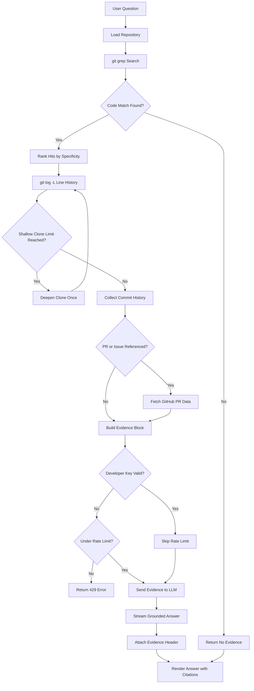

```mermaid
flowchart TD
    A["User Question"] --> B["Load Repository"]
    B --> C["git grep Search"]
    C --> D{"Code Match Found?"}
    D -- No --> E["Return No Evidence"]
    D -- Yes --> F["Rank Hits by Specificity"]
    F --> G["git log -L Line History"]
    G --> H{"Shallow Clone Limit Reached?"}
    H -- Yes --> I["Deepen Clone Once"]
    I --> G
    H -- No --> J["Collect Commit History"]
    J --> K{"PR or Issue Referenced?"}
    K -- Yes --> L["Fetch GitHub PR Data"]
    K -- No --> M["Build Evidence Block"]
    L --> M
    M --> N{"Developer Key Valid?"}
    N -- Yes --> O["Skip Rate Limit"]
    N -- No --> P{"Under Rate Limit?"}
    P -- No --> Q["Return 429 Error"]
    P -- Yes --> R["Send Evidence to LLM"]
    O --> R
    R --> S["Stream Grounded Answer"]
    S --> T["Attach Evidence Header"]
    T --> U["Render Answer with Citations"]
    E --> U
```